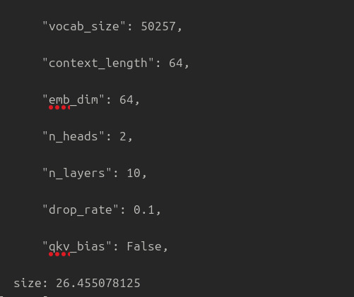
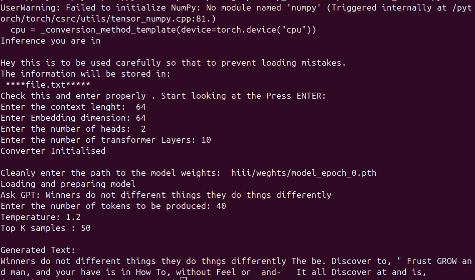

##  How to Run

###  Language & Framework

* **Language**: Python
* **Framework**: PyTorch

---
### Archirtecture of GPT2

###  Installation

Make sure you have Python installed, then run the following commands to set up the environment:

```bash
## Installation

To install the package without ML dependencies:
pip install sagar-nueron-gpt2

To include ML dependencies (torch and tiktoken):
pip install sagar-nueron-gpt2[ml]


pip install torch
pip install tiktoken
```

---

###  Train the Model

To train and save your GPT-2 model weights, run the following:

```python
from sagar_nueron_gpt2.TrainAndSaveGptWeights import Execute

exe = Execute()
exe.execute()
```

---

###  Inference from Trained Model
But the model information will be there in the folder where the weights and information:


To run inference using the model you trained:

```python
from sagar_nueron_gpt2.inference_model import Inferencing

exe = Inferencing()
exe.inference()
```
This is How it looks: 
#### This kind of file will be produced after training.In the folder you gave name as input while training. 

#### This is an example on how to give input while training.


---


